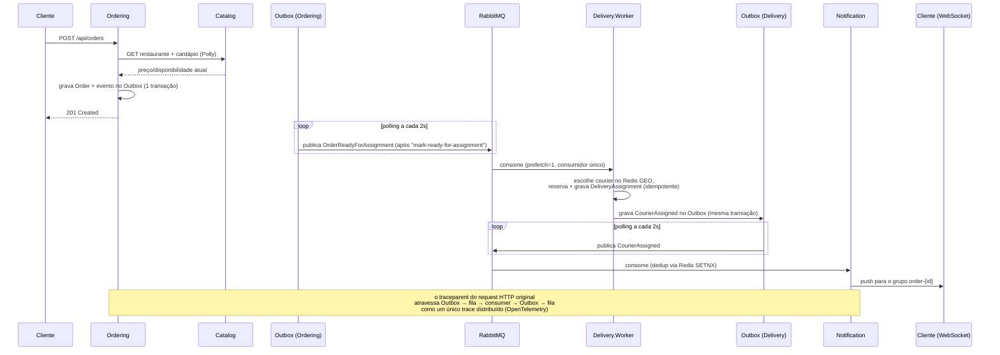
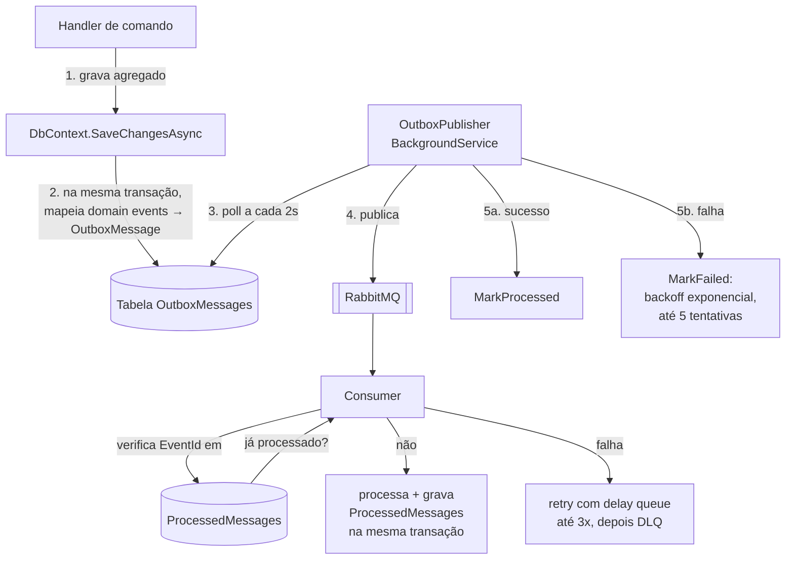
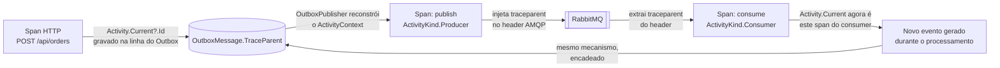
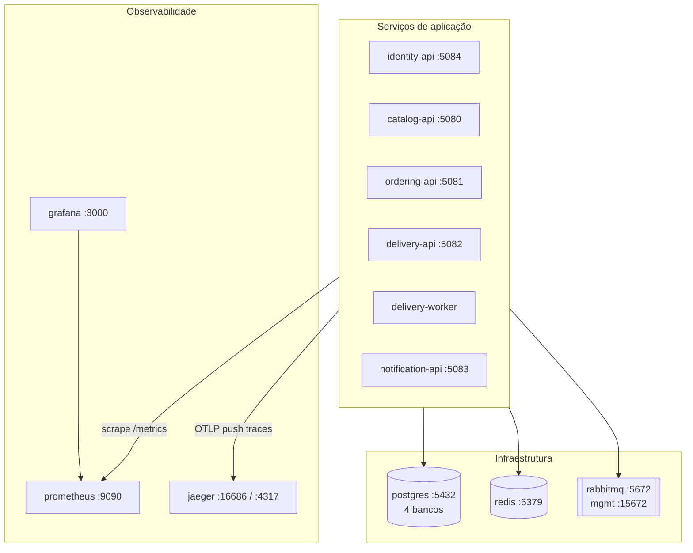

# Arquitetura — QuickOrder

Este arquivo mostra o *desenho* do sistema: como os serviços se conectam, como um
pedido flui de ponta a ponta, e como a infraestrutura está organizada. Para o *porquê*
de cada decisão, veja [DECISOES-DE-ARQUITETURA.md](DECISOES-DE-ARQUITETURA.md).

## Visão geral dos serviços

```mermaid
flowchart LR
    subgraph Client["Cliente (app/web)"]
        C[HTTP + WebSocket]
    end

    subgraph Identity["Identity.Api"]
        ID[(Postgres<br/>quickorder_identity)]
    end

    subgraph Catalog["Catalog.Api"]
        CA[(Postgres<br/>quickorder_catalog)]
        CR[(Redis<br/>cache-aside)]
    end

    subgraph Ordering["Ordering.Api"]
        OR[(Postgres<br/>quickorder_ordering)]
    end

    subgraph Delivery["Delivery.Api + Delivery.Worker"]
        DE[(Postgres<br/>quickorder_delivery)]
        DR[(Redis<br/>GEO couriers)]
    end

    subgraph Notification["Notification.Api"]
        NR[(Redis<br/>backplane + dedup)]
        SR[SignalR Hub]
    end

    MQ[[RabbitMQ]]

    C -->|login/refresh| Identity
    C -->|cardápio| Catalog
    C -->|criar/consultar pedido| Ordering
    C -->|cadastro entregador| Delivery
    C <-->|WebSocket: order-tracking| SR

    Ordering -->|HTTP síncrono<br/>via Polly| Catalog

    Catalog -->|publica eventos<br/>Outbox| MQ
    Ordering -->|publica eventos<br/>Outbox| MQ
    Delivery -->|publica eventos<br/>Outbox| MQ

    MQ -->|OrderReadyForAssignment| Delivery
    MQ -->|CourierAssigned, OrderStatusChanged| Notification

    Identity -.->|valida JWT<br/>(chave compartilhada por config)| Catalog
    Identity -.-> Ordering
    Identity -.-> Delivery
```

Cada serviço com domínio próprio (todos, exceto Notification) segue **Clean
Architecture**: `Domain` (entidades, agregados, eventos, invariantes) →
`Application` (casos de uso via MediatR + FluentValidation) → `Infrastructure`
(EF Core, RabbitMQ, Redis) → `Api`/`Worker` (HTTP/hosting). Nenhum serviço referencia o
`Domain` de outro — o único código compartilhado é `QuickOrder.Contracts` (formato dos
eventos de integração e das chaves de roteamento), nunca modelo de domínio.

## Fluxo de um pedido, do clique ao "entregue"



Pontos que vale destacar neste fluxo:

- **Nenhuma chamada síncrona depois do `POST /api/orders`** — tudo que acontece após
  isso (preparo, atribuição de entregador, notificação) é dirigido por eventos.
- **A única chamada HTTP síncrona entre serviços do sistema inteiro** é
  Ordering → Catalog, no momento de criar o pedido — e é exatamente aí que mora o
  pipeline de resiliência do Polly (timeout → retry → circuit breaker).
- **Atribuição de entregador não usa lock distribuído.** Só existe um consumidor
  (`prefetch=1`) processando a fila `delivery.order-ready-for-assignment` — a ordem de
  entrega de mensagens do RabbitMQ já serializa o acesso ao recurso escasso (courier
  disponível), sem precisar de `SETNX`/lock do Redis para isso.

## Outbox Pattern — como a garantia de entrega funciona



Como isso elimina os dois modos de falha clássicos de mensageria:

- **"Salvei o agregado mas a mensagem se perdeu"** — impossível, porque o agregado e a
  linha do Outbox são gravados na mesma transação do EF Core (passo 1-2). Se a
  transação falhar, nenhum dos dois é persistido; se tiver sucesso, os dois estão lá.
- **"A mensagem chegou duas vezes e processei duas vezes"** — o consumidor confere o
  `EventId` contra `ProcessedMessages` (Postgres, com garantia forte porque a
  atribuição de entregador é uma operação que não pode duplicar) ou contra um `SETNX`
  no Redis com TTL (Notification, onde duplicar só afeta UX, não dados) — a garantia
  usada é proporcional ao custo real de uma duplicata, não a mesma receita em todo lugar.

## Rastreamento distribuído através da fila

HTTP ganha tracing de graça (instrumentação automática do ASP.NET Core/HttpClient);
RabbitMQ não. O `traceparent` (W3C Trace Context) é propagado manualmente em cada hop:



O caso mais interessante do sistema: o `Delivery.Worker` **consome** o evento
`OrderReadyForAssignment` e, durante o processamento (ainda dentro do span do
consumer), **publica** um novo evento `CourierAssigned` — o trace continua através dos
dois papéis do mesmo processo, sem que nenhum dos lados soubesse de antemão que fariam
parte da mesma requisição original. O trace completo (`PlaceOrder` → Ordering publica →
Delivery consome e publica → Notification consome → push SignalR) aparece como uma
única árvore de spans no Jaeger, atravessando três processos e duas travessias de fila.

## Infraestrutura (Docker Compose)



Um único `docker compose up -d --build` sobe as 6 imagens (multi-stage: SDK para
`dotnet publish`, runtime `aspnet` enxuto) mais a infraestrutura inteira. Toda
configuração específica de container (hostnames, connection strings) entra via
variáveis de ambiente (`ConnectionStrings__Postgres`, `RabbitMq__HostName`, etc.) por
cima dos `appsettings.json` de cada serviço — nenhum arquivo de config foi alterado
para acomodar o Compose, então rodar cada serviço direto do `dotnet run` continua
funcionando sem nenhuma mudança.

## Estrutura de pastas de um serviço típico

```
src/Ordering/
├── Ordering.Domain/          # Order, OrderItem, OrderStatus — sem dependências externas
├── Ordering.Application/     # Commands/Queries (MediatR), validators, interfaces de repositório
├── Ordering.Infrastructure/  # EF Core, OutboxPublisher, HttpCatalogClient (+ Polly), RabbitMQ
└── Ordering.Api/             # Controllers, Program.cs, appsettings.json, Dockerfile
```

`Notification.Api` é a exceção deliberada: um único projeto, sem `Domain`/`Application`
nem banco próprio — ele não protege nenhuma invariante de negócio, só traduz eventos em
mensagens SignalR (ver item 31 de [DECISOES-DE-ARQUITETURA.md](DECISOES-DE-ARQUITETURA.md)).
